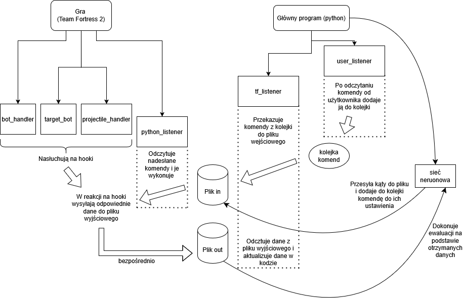
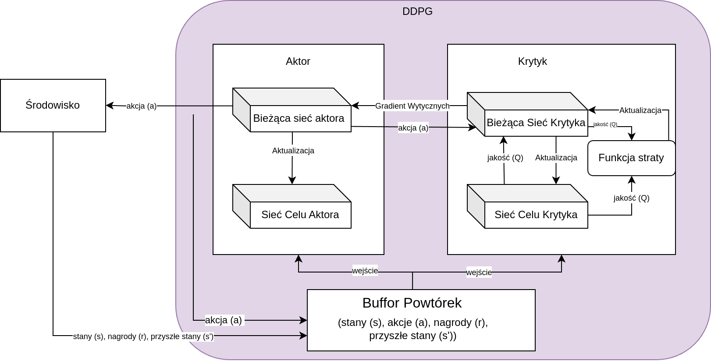
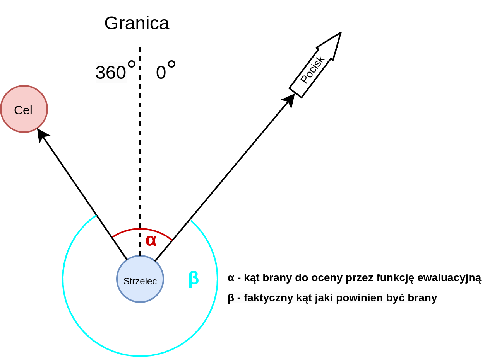

% Uczenie ze wzmocnieniem do gry Team Fortress 2
% Mateusz Tarasewicz 197848; Maciej Jabłonowski 198030; Łukasz Kołakowski 198000

# Wstęp

Celem niniejszego projektu było zaprojektowanie i wytrenowanie agenta, który potrafi samodzielnie namierzać oraz trafiać w nieruchomy cel w grze Team Fortress 2. TF2 to wieloosobowa gra FPS osadzona w trójwymiarowym świecie, oferująca dziewięć zróżnicowanych klas postaci oraz szeroki wybór broni. W naszym przypadku agent reprezentuje klasę żołnierza, wyposażoną w rakietnicę – broń wybraną ze względu na prostą trajektorię pocisków oraz możliwość ich śledzenia w przestrzeni gry.

Środowisko gry zostało dostosowane i jest zarządzane za pomocą skryptów w języku Squirrel, który wykorzystywany jest w TF2 do obsługi logiki map i serwera. Pozwoliło to na modyfikację elementów rozgrywki oraz uzyskiwanie dostępu do niezbędnych danych. Główna logika programu polega na cyklicznym przesyłaniu informacji o pozycji agenta i celu z gry do skryptu w języku Python, a następnie zwracaniu wyliczonych kątów obrotu widoku agenta. Komunikacja między grą a modułem decyzyjnym odbywa się poprzez wymianę plików. Proces uczenia został zrealizowany w oparciu o algorytmy uczenia ze wzmocnieniem (reinforcement learning).

# Opis środowiska

Środowisko stanowi uproszczoną, trójwymiarową przestrzeń gry. W ramach projektu przygotowano prostą, otwartą mapę, co umożliwiło łatwiejszą konfigurację i kontrolę warunków treningowych. Po uruchomieniu skryptów, agent jest rozmieszczany losowo w centralnym obszarze mapy, wewnątrz koła o z góry określonym promieniu. Nieruchomy cel również generowany jest losowo w pobliżu agenta, a jego pozycja zmienia się cyklicznie po ustalonej liczbie kroków.

Agent podejmuje decyzje na podstawie aktualnej sytuacji w grze, uwzględniając swoją pozycję oraz lokalizację celu. Jego przestrzeń akcji ogranicza się do obracania widoku w dwóch osiach (pionowo i poziomo) oraz oddania strzału z rakietnicy. Aby wspierać proces uczenia, zastosowano system nagród: agent otrzymuje punkty za trafienie celu lub za strzał blisko jego pozycji, natomiast kary przyznawane są za nieefektywne zachowania, takie jak strzelanie pionowo w górę lub w dół.

Cykl działania środowiska rozpoczyna się od przesłania parametrów konfiguracyjnych, po czym agent wybiera akcję. Następnie system analizuje wynik strzału oraz oblicza odległość pocisku od celu, aby przypisać odpowiednią wartość nagrody.

# Mechanizm hooków w grze TF2

Zanim przejdziemy do szczegółowego omówienia mechanizmu komunikacji, warto wyjaśnić mechanizm hooków, z którego intensywnie korzystaliśmy w naszym projekcie.

Hooki w środowisku gry TF2 (a dokładniej: w systemie skryptowym opartym na języku Squirrel) można rozumieć jako mechanizm globalnych zdarzeń lub punktów zaczepienia. Pozwalają one na wysyłanie komunikatów, które mogą być przechwytywane i obsługiwane przez inne skrypty – nawet jeśli znajdują się w zupełnie innym pliku.

W praktyce oznacza to, że:

-   dowolny skrypt może wywołać hooka, przekazując przy tym zestaw parametrów (np. identyfikator bota, pozycję, kąty itp.),
-   inny skrypt może zarejestrować się do nasłuchiwania danego hooka i odpowiednio zareagować na jego uruchomienie – np. wykonać akcję lub zmodyfikować stan gry.

Hooki umożliwiają tym samym luźne powiązanie między modułami — skrypt uruchamiający hooka nie musi znać szczegółów implementacji jego obsługi. Dzięki temu możliwa jest elastyczna i rozszerzalna architektura komunikacji w grze

# Komunikacja między środowiskiem a programem głównym

Komunikacja między środowiskiem, czyli grą Team Fortress 2 (TF2), a programem głównym w Pythonie realizowana jest poprzez system plików. Kluczowe elementy tego systemu to:

-   folder gry ~/tf/scriptdata, w którym umieszczane są pliki komunikacyjne,
-   skrypt w języku Squirrel o nazwie python_listener.nut,
-   oraz skrypt w Pythonie squirrel_api.py.

## squirrel_api.py – pośrednik między kodem Pythona a plikami

Ten moduł odpowiada za obsługę komunikacji po stronie Pythona. Jego główne zadania to:

-   Odczyt konfiguracji – przy uruchomieniu wczytywany jest plik config.json, z którego pobierana jest ścieżka do folderu instalacyjnego gry.
-   Zapis danych wejściowych – funkcja handler_squirrel_input(queue) przyjmuje kolejkę wiadomości i zapisuje je do pliku squirrel_in. Plik ten jest następnie odczytywany po stronie gry.
-   Odczyt danych wyjściowych – funkcja handle_squirrel_output(bot_map) przyjmuje słownik, którego kluczami są identyfikatory botów (numpy.int64), a wartościami – obiekty klasy TfBot. Funkcja ta wczytuje dane z pliku squirrel_out i aktualizuje odpowiednie pola w obiektach TfBot.

Podsumowując: squirrel_api.py zapewnia dwukierunkowy przepływ danych między systemem plików a strukturami danych w Pythonie.

## python_listener.nut – interpretacja poleceń i integracja z grą

Ten skrypt działa wewnątrz gry TF2 i jest odpowiedzialny za przetwarzanie komend z pliku wejściowego oraz przekazywanie danych z Pythona do gry. Działanie polega na utworzeniu bota w grze i przypisaniu do niego funkcji nasłuchującej na komendy, powtarzanej, aż do wyłączenia bota, co każdy tick serwera. Jego główne funkcje:

-   Odczyt komend – w nieskończonej pętli monitoruje zawartość pliku squirrel_in. Jeżeli odczytane dane stanowią poprawne komendy, wykonywane są odpowiednie działania (np. wywoływany jest hook do przekazania pozycji botów).
-   Ustawianie kątów celowania – po obliczeniu przez sieć neuronową zestawu kątów celowania, dane te trafiają do pliku, z którego python_listener.nut je odczytuje. Następnie za pomocą hooka ustawia odpowiednie wartości w grze dla wybranych botów.

## Wykaz komend obsługiwanych przez python_listener.nut.

| Komenda            |                                                                                                                                                  Działanie |
| :----------------- | ---------------------------------------------------------------------------------------------------------------------------------------------------------: |
| start              |                                                                     Ustawia zmienną start_program na wartość true co umożliwia odczytywanie innych komend. |
| exit               |                                         Wywołuje hooki kończące działanie pozostałych skryptów (bot_handler.nut, projectile_handler.nut i target_bot.nut). |
| get_position       |                                                                    Wywołuje hook, który zapisuje pozycje botów strzelających i celu do pliku squirrel_out. |
| angles             | Odczytuje kąt celowania dla każdego bota (pitch, yaw) z pliku wejściowego, zapisuje je do zmiennej bot_angle_data i wywołuje hook ustawiający kąty w grze. |
| send_damage        |                                                               Wywołuje hook wysyłający informacje o zadanych obrażeniach przez boty do pliku squirrel_out. |
| send_distances     |                                                                  Wywołuje hook wysyłający dane o odległościach wystrzelonych rakiet do pliku squirrel_out. |
| change_shooter_pos |                                                                                                     Wywołuje hook zmieniający pozycję botów strzelających. |
| change_target_pos  |                                                                                                     Wywołuje hook zmieniający pozycję bota będącego celem. |

Podsumowując: python_listener.nut pełni rolę interpretatora komend po stronie gry. Odpowiada za przetwarzanie danych z pliku squirrel_in, wykonywanie odpowiednich akcji w grze (przez hooki), oraz za przekazywanie informacji zwrotnych z gry do pliku squirrel_out, skąd mogą być one odczytane przez program w Pythonie.

## Schemat ilustrujący komunikację



# Model uczenia

W naszym modelu został zaimplementowany algorytm uczenia głębokiego DDPG
(Deep Deterministic Policy Gradient). Został on wybrany, ponieważ nasz
problem jest natury ciągłej, pozycje _pitch_ i _yaw_ wyrażone w
stopniach są w zakresach odpowiednio $[-90,90]$ oraz $[0,360]$.
Dyskretyzacja ich byłaby nieefektywna i znacząco zwiększyła by wielkość
sieci. Algorytm DDPG został zaprojektowany z myślą o ciągłej dziedzinie
wyniku z sieci neuronowej, więc idealnie pasuje do naszego problemu.
Jest to algorytm _off-policy_ czyli może się uczyć wiele razy na
podstawie jednej akcji, dane zapisywane są buferze i potem wiele razy
przepuszczane przez sieć neuronową, pozwala to sieci wyciągnąć o wiele
więcej informacji z jednego przebiegu.

_Poniżej_ znajduje się
uproszczony schemat działania sieci:



Aktor -- Odpowiedzialny jest za podejmowanie akcji, w naszym przypadku
wybiera kąty _pitch_ i _yaw._

Krytyk -- Jego zadaniem jest ewaluacja rozwiązania (jakości rozwiązania)
podjętej przez aktora i utworzenie gradientu na podstawie którego Aktor
będzie się uczyć.

Bufor Powtórek -- Bufor który przechowuje wszystkie poprzednie akcje
wykonane przez aktora, do uczenia, na wejście brana jest losowa porcja
poprzednich sytuacji w których znalazł się Aktor.

Akcja -- W naszym przypadku kąty z zakresu $[-90,90]$, $[0,360]$

Stany -- Informacje wejściowe do sztucznej inteligencji, w naszym
przypadku pozycja (x,y,z) strzelca oraz (x,y,z) celu.

Nagroda -- Obliczona przez nas ocena zachowania aktora.

Bieżąca sieć aktora/Krytyka -- Są to główne sieci neuronowe,
odpowiedzialne za znajezienie optymalnego rozwiązania.

Sieć Celu Krytyka/Aktora -- Są to kopie sieci bieżących, w odróżnieniu
od sieci głównych aktualizowane są powoli, pozwala to ustabilizować
uczenie się sieci głównej. Niejako odpowiedzialna jest za zapamiętywania
głównego trendu sieci głównej, gdy ta może eksplorować z większą
dowolnością.

# Szczegóły implementacyjne

Działanie naszego programu opiera się o podanym wyżej algorytmie DDPG. Dane na początku są pobierane ze środowiska (pozycje (x,y,z) strzelca, oraz (x,y,z) przeciwnika). Potem wykonujemy losową akcję (robimy tak na początku, by zebrać reprezentatywną próbkę zdarzeń do Buforu Powtórek), albo akcję wybraną przez sieć neuronową.

Decyzja wybrana przez sieć neuronową jest modyfikowana przez szum Ornsteina Uhlenbecka, jest on zalecany przez prace naukowe zajmujące się te tym algorytmem, jego pracę można porównać do wskaźnika giełdowego, który posiada znaczące oscylacje, ale trzyma się ogólnemu tendrowi wykresu. W naszym przypadku jest on odpowiedzialny za szukanie nowych rozwiązań, ma zapobiegać zatrzymywaniu się SI na suboptymalnym rozwiązaniu.

Po podjęciu decyzji przez Aktora, dane są wysyłane do środowiska z którego dostajemy informację zwrotną, w postaci obrażeń zadanych przez Aktora, jak i odległość pocisku od celu. Na podstawie następuje ewaluacja w dwóch wariantach:

-   Najmniejsza odległość euklidesowa pocisku od celu (im mniejsza tym lepiej) + obrażenia zadane przez Aktora (jeżeli trafił). Jeżeli pocisk oddala się od samego początku od celu, wysyłamy odległość po określonym czasie.
-   Cosinus kąta między wektorami strzelec-cel, a strzelec-pocisk. Nagroda jest wtedy od razu znormalizowana w przedziale od -1 do 1 i nagroda płynniej zbiega się do celu porównując z poprzednią metodą.

Jeżeli zbierzemy wystarczającą liczbę danych, to w każdej kolejnym obiegu będziemy uczyć naszą sieć neuronową. Z Buforu Powtórek wybieramy o rozmiarze zdefiniowanym w hiperparametrze paczkę (batch), która zostanie wykorzystana do nauki sieci Krytyka. Sieć Aktora jest optymalizowana przez poprzednio zaktualizowaną sieć Krytyka, jest tak ponieważ takie jest założenie algorytmu DDPG, wynika ona z tego że w bardziej zaawansowanych środowiskach sama funkcja zysku i straty może być niemiarodajna i krótkowzroczna. To zadaniem Krytyka jest znalezienie zależności na podstawie których zysk jest największy.
Po aktualizacji sieci Aktora zbieramy dane statystyczne i pętla się powtarza.

Poniżej zostaną pokazane uproszczone pseudokody opisujące ogólne
działanie programu:

### Główna pętla programu

```
def train():
    buffer = init_buffer()
    actor = init_actor()
    actor_target = copy(actor)
    critic = init_critic()
    critic_target = copy(critic)
    observations = get_observations_from_game()

    for step in 0..n:
        if step > learning_starts:
            actions = select_action(observations)
        else:
            actions = select_random_action()

        next_observations, rewards = resolve_action_in_game()
        add_to_buffer(buffer, observations, rewards, next_observations)

        learn(actor, actor_target, critic, critic_target, buffer)

        observations = next_observations
```

### Funkcja ucząca

```
def learn(actor, actor_target, critic, critic_target,  buffer):
	observations, actions, rewards, next_observations = get_random_sample(buffer)

	next_state_q = target_critic(next_observations, actor(next_observations))
	target_q = rewards + gamma ^ num_steps * next_state_q

	current_action_q = critic(observations, actions)
	critic_loss = mse_loss(current_action_q, target_q)
	optimize(critic, gradient(critic_loss))

	current_action_q = critic(observations, actor(observations))
	actor_loss = - mean(current_action_q)
	optimize(actor, gradient(actor_loss))
	soft_update(actor_target, tau)
	soft_update(critic_target,tau)
```

### Funkcja ewaluacyjna w dwóch wariantach:

wariant 1: najmniejsza odległość między pociskiem a celem:

```
def evaluate(actions, observation, bot_positions, damage_dealt):
	shooter_pos, target_pos = dispatch_into_shooters_targets(bot_positions)
	distance = distance(shooter_pos, target_pos)
	reward = (-(distance)^2 + damage_dealt)
	return reward
```

wariant 2: cosinus kąta między wektorem strzelec → cel, a strzelec →
pocisk

```
def evaluate(actions, observations, bot_positions):
	v_shooter_missile, v_shooter_target = create_vectors(bot_positions)
	rewards = cos_between_vectors(v_shooter_missile, v_shooter_target)
	return rewards
```

# Parametry sieci

Nasza implementacja posiadała wiele iteracji, zostaną w tabeli pokazane zakresy wartości w jakich był sprawdzany model:

| Hiperparametr      |                                           Opis                                           |    Wartości     |
| :----------------- | :--------------------------------------------------------------------------------------: | :-------------: |
| learning_starts    | Liczba kroków w których Aktor podejmuje losowe akcje, by zapełnić bufor powtórek danymi. |   $[1, 5000]$   |
| gamma              |                                Współczynnik dyskontowania                                |     $0.99$      |
| lr (learning rate) |                                Współczynnik tempa uczenia                                | $[0.1,10^{-5}]$ |
| hidden_dim         |                    Liczba węzłów w warstwie ukrytej sieci neuronowej                     |   $[16, 128]$   |
| tau                |                     Współczynnik nauki dla Sieci Celu Aktora/Krytyka                     |     $0.05$      |
| noise_sigma        |                    Odchylenie standardowe szumu Ornsteina–Uhlenbecka                     |  $[0.01, 0.5]$  |
| noise_theta        |          Tempo powrotu funkcji szumu Ornsteina–Uhlenbecka do wartości średniej           |  $[0.01,0.05]$  |

Sieć:

| Parametr                            |                          Wartości                          |
| :---------------------------------- | :--------------------------------------------------------: |
| Liczba parametrów wejściowych       |                            $6$                             |
| Funkcja aktywacyjna                 |                            ReLU                            |
| Liczba warstw ukrytych              |                         $[1, 3]$\*                         |
| Liczba węzłów w warstwie ukrytej    |                        $[16, 128]$                         |
| Funkcje aktywacyjne warstw ukrytych |                            ReLU                            |
| Liczba parametrów wyjściowych       |                            $2$                             |
| Funkcja aktywacyjna                 |                            Tanh                            |
| Skalowanie wyjścia                  | Odpowiednio: 1: $[0,360]$, 2: $[-89,89]$ lub 2: $[-70, 0]$ |

\* - był też testowany wariant z zastosowaniem batch normalization wewnątrz sieci neuronowej.

# Wyniki

Niestety mimo naszych największych starań nie udało nam się wytrenować sieci neuronowej. Mimo wielu zmian w kodzie, funkcji ewaluacyjnej czy zmian hiperparametrów, sieć neuronowa albo zatrzymywała się na jednym suboptymalnym obszarze, albo po przejściu nawet 35 tysięcy iteracji cały czas nie załapała sensu zadania. W trakcie pisania tego sprawozdania, sieć neuronowa cały czas się uczy, jest na 47 000 iteracji. Czasami widać jakby rozumiała o co chodzi w zadaniu, ale czy wyniki będą zadowalające dowiemy się za parę dni, których nie mamy ze względu na termin oddawania projektu. Projekt będzie rozwijany we własnym zakresie.

# Możliwe przyczyny

Bardzo prawdopodobnym scenariuszem jest po prostu błąd w kodzie, który uniemożliwa nauczenie się. Nasz program składa się ze środowiska Team Fortress 2, skryptów w języku Squirrel oraz kodzie w języku Python. W każdej z tych trzech miejsc może wystąpić błąd, co znacznie utrudnia znalezienie przyczyny.

Możliwe też że znalezienie celu dla sieci neuronowej jest po prostu za trudne, margines błędu kąta jaki musi być by trafić, na ustalonej przez nas odległości wynosi mniej niż 1°. Przeczy tej tezie jednak nasza funkcja ewaluacyjna która płynnie zwiększa się jak agent trafia bliżej celu.

Ze względu jakie dobrane są parametry wyjściowe, Aktor może dostawać fałszywą nagrodę. Kierunek yaw (lewo, prawo) jest ograniczony w kątach [0°, 360°] i nie może tej granicy płynnie przekraczać, więc jeżeli optymalny kąt wynosi 340° a nasz Aktor wskaże kąt 10°, to może wprowadzić w błąd, twierdząc że jest blisko rozwiązania (obiektywnie jest blisko rozwiązania, ale sugerując się tą informacją może nigdy nie osiągnąć sukcesu).

Wizualizacja na rysunku:

{width=50%}

Link do repozytorium:
<https://github.com/Satan-Vicovaro/TF2_powered_by_AI/>
